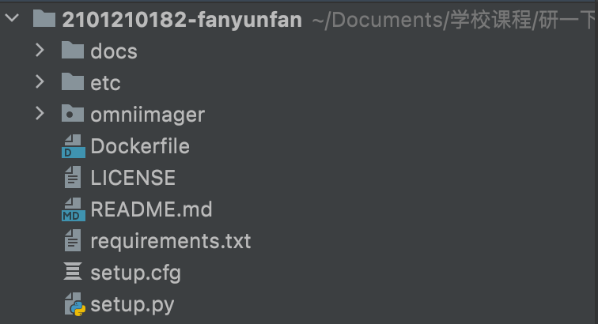

## Omni-Imager 解读

### Omni-Imager 包结构解析

#### 包结构图

		

#### 包结构解析

1. docs 目录：主要存放与 Omni-Imager 相关的文档（包括主要包含的包和解读文档）

	2.  etc 目录：支持 Anaconda iso 的 comps 文件
	2.  omniimager 目录：构建 Omni-Imager 的主要 python 文件
	2.  LICENSE 文件：开源许可证。采用的是木兰宽松许可证，第 2 版 
	2.  README.md 文件：Omni-Imager 使用方法的相关介绍
	2.  requirements.txt：使用 python 构建 Omni-Imager 所需依赖
	2.  setup.cfg 和 setup.py：用于打包 Omni-Imager 的文件

------

####  Omni-Imager 构建

拿 **cli.py**举例

**构建启动镜像**

```python
@click.command()
@click.argument('build-type')
@click.option('--config-file', help='Configuration file for the software.')
@click.option('--package-list', help='The list of packages that you want to put into your image.')
@click.option('--repo-files', help='The list of repo files that you want to use, the program will consolidate them.')
@click.option('--product', help='Product Name.')
@click.option('--version', help='Version Identifier.')
@click.option('--release', help='Release.')
@click.option('--variant', help='Variant.')
@click.option('--output-file', default='openEuler-image.iso', help='The output image file name.')
def build(build_type, config_file, package_list, repo_files, product, version, release, variant, output_file):
    imager.build(build_type, config_file, package_list, repo_files, product, version, release, variant, output_file)
```

通过 click 来实现命令行界面，并添加了一系列参数，如：`--config-file`、`--package-list` 等。

**编辑 Ananconda 安装程序 ISO 的 kickstart 配置脚本**

```python
@click.command()
@click.argument('resource-type')
@click.option('--config-file', help='Configuration file for the software.')
@click.option('--iso', help='The source iso you want to edit.')
@click.option('--ks', help='The kickstart config file you want to added to the ISO.')
@click.option('--output-file', help='The output image file name.')
@click.option('--loop-device', default='auto', help='Custom loop device path')
def edit(resource_type, config_file, iso, ks, output_file, loop_device):
    editor.edit(resource_type, config_file, iso, ks, output_file, loop_device)
```

同样通过 click 来实现命令行界面，并添加相关参数。

**加载 Ananconda 安装程序 ISO 的 kickstart 配置脚本**

```python
@click.command()
@click.argument('resource-type')
@click.option('--config-file', help='Configuration file for the software.')
@click.option('--iso', help='The source iso you want to edit.')
@click.option('--output-file', default='ks.cfg', help='The output file name.')
@click.option('--loop-device', default='auto', help='Custom loop device path')
def load(resource_type, config_file, iso, output_file, loop_device):
    editor.load(resource_type, config_file, iso, output_file, loop_device)
```

同样通过 click 来实现命令行界面，并添加相关参数。

------

#### **requirements 依赖**

```
click
pbr >= 5.8.1
pychroot >= 0.10.4
pyyaml >= 5.0
wget >= 3.0
libcomps
configparser
pykickstart
```

1. **click**

   **click** 是一个简洁好用的 Python 模块，它能用尽量少的代码**实现**漂亮的**命令行界面**。它不仅开箱即用、还能支持高度自定义的配置。

2. **pbr**

   **pbr **是 setuptools 的辅助工具，最初是为 OpenStack 开发(https://launchpad.net/pbr)，基于 d2to1。

   **pbr** 会读取和过滤 `setup.cfg` 中的数据，然后将解析后的数据提供给 `setup.py` 作为参数。包含如下功能：

   1. 从 git 中获取 Version、AUTHORS and ChangeLog 信息
   2. Sphinx Autodoc。pbr 会扫描 project，找到所有模块，生成 stub files
   3. Requirements。pb r会读取 requirements.txt，生成 setup 函数需要的`install_requires/tests_require/dependency_links`

3. **pychroot**

   **pychroot** 是一个简化 chroot 处理的 python 库和 cli 工具。 具体地说，库提供了一个 **chroot** 上下文管理器，它支持 当 **pychroot**  实用程序的工作方式非常类似于终端中的扩展 **chroot** 命令。

4. **pyyaml**

   **pyyaml** 是 Python 的一个专门针对 yaml 文件操作的模块。yaml 是一种比 xml 和 json 更轻的文件格式，也更简单更强大，它可以通过缩进来表示结构。

5. **wget**

   GNU Wget（常常简称为 **wget**）是一个网络上进行下载的简单而强大的自由软件， 其本身也是 GNU 计划的一部分。 它的名字是 "World Wide Web" 和 "Get" 的结合， 同时也隐含了软件的主要功能。 目前它支持 HTTP、HTTPS，月以及 FTP 这三个常见的的 TCP/IP 协议下载。

6. **libcomps**

​		**libcomps** 是 yum.comps 库的替代方法。 它是用纯 C 语言编写的具有 Python 绑定的库。

 7. **configparser**

    **ConfigParser** 模块在 python3 中修改为 **configparser**。这个模块定义了一个 ConfigParser 类，该类的作用是使用配置文件生效，配置文件的格式和 windows 的 INI 文件的格式相同。

    该模块的作用就是使用模块中的 `RawConfigParser()`、`ConfigParser()`、 `SafeConfigParser() `这三个方法，创建一个对象使用对象的方法对指定的配置文件做增删改查 操作。

 8. **pykickstart**

    **pykickstart** 是一个 python 库，用于读取和写入 kickstart 文件。它提供了一个通用的数据表示、一个解析器和一个编写器。

#### Omni-Imager 打包

**setup.cfg**

在各参数后面添加注释，来表明各个参数的含义。

```
[metadata] 
name = omniimager # 包名
version = 0.4.2   # 版本号
summary = Image Build Service of the Omni Build Platform # 包简介
description_file =  # 描述文件
    README.md
author = Fan YunFan # 作者
author_email = fanyunfan@stu.pku.edu.cn # 作者邮箱
python_requires = >=3.8 # python 版本要求
url = https://github.com/omnibuildplatform/omni-imager # 包文件的主页
classifiers =
    Development Status :: 3 - Alpha
    Environment :: OmniBuildPlatform
    Intended Audience :: Information Technology
    Intended Audience :: System Administrators
    License :: OSI Approved :: Mulan PSL v2
    Operating System :: POSIX :: Linux
    Programming Language :: Python
    Programming Language :: Python :: 3
    Programming Language :: Python :: 3.8
    Programming Language :: Python :: 3.9
    Programming Language :: Python :: 3 :: Only
    Programming Language :: Python :: Implementation :: CPython

[files] # 文件
data_files = # 指定目的目录和源文件路径
    etc/omni-imager = etc/*

packages = # 包
    omniimager

[entry_points] # 入口点
console_scripts =
    omni-imager = omniimager.cli:main
```

**setup.py**

```
import setuptools

setuptools.setup(
    setup_requires=['pbr>=2.0.0'],
    pbr=True)
```

Omni-Imager  是通过 setuptools 来进行打包的。setuptools 是 distutils 增强版，不包括在标准库中。其扩展了很多功能，能够帮助开发者更好的创建和分发 Python 包。

使用 `setup.py` 方法：

- 使用命令行参数指定，一个一个将参数传递进去（极不推荐）
- 在 `setup.py` 中的 **setup** 函数中指定（推荐使用）

- 使用  **pbr** ，在 **setup.cfg** 中指定（易于管理，更推荐）。（Omni-Imager 构建采用的是这种方法）

## Omni-Imager 主要组成

### Imager

------

Imager  是镜像构建工作流程的协调者和主要入口。 它将调用其他 python 文件中的函数，例如 `installer_maker.py`、`iso_worker`、`pkg_fether` 等。

imager worker 将支持多个后端，例如 `raw`、`calamares-installer` 和 `anaconda-installer(WIP)`，以支持不同类型的镜像。

构建 ISO 镜像文件的整体工作流程如下：

1. 生成安装镜像

   1. 对于 Calamares 安装程序：

      1. 根据 rootfs 包列表准备 rootfs (`rootfs_worker.py`)
      2. 构建、安装和配置 Calamares 安装程序 (`installer_maker.py`)
      3. 可以通过在配置文件中指定 `use_cached_rootfs: True` 和 `cached_rootfs_gz: /opt/rootfs_cache/rootfs.tar.gz` 来使用预构建的 rootfs 和 Calamares 安装程序

   2. 对于 Anaconda 安装程序：

      调用 `lorax` 使用预配置模板构建安装程序映像

2. 根据用户规范下载软件包 ( `dnf` 命令) (`pkg_fetcher.py`)

3. 准备 `isolinux` 相关的二进制文件

4. 使用 `mkisofs` (`iso_worker.py`) 生成 ISO 文件

5. 如果需要，添加 `kickstart` 配置文件

### CLI

------

Omni-Imager 目前支持 3 个 CLI：

1. 构建启动镜像，目前我们支持构建两种类型的 ISO 镜像：
   1. 用户提供的软件包列表中的 Live-CD 镜像，这种类型的 ISO 镜像是可启动的，可以加载到内存中，镜像启动后的修改将在镜像重新启动后恢复，可用于测试和演示目的。
   2. 带有 Calamares GUI 安装程序的 ISO 镜像，该类型的 ISO 镜像将提供 GUI 安装程序并指导用户将提供的 openEuler 系统安装到新磁盘，可用的软件包列表由用户提供。
2. 加载 Ananconda 安装程序 ISO 的 kickstart 配置脚本，Ananconda 安装程序支持使用脚本(kickstart 配置脚本)来自动运行安装程序作业，Omni-Imager 提供了一个 CLI 来从用户提供的 ISO 文件加载 kickstart 脚本以供进一步使用。
3. 编辑 Ananconda 安装程序 ISO 的 kickstart 配置脚本，用户可以使用此 CLI 使用用户提供的 kickstart 文件覆盖给定 ISO 的现有 kickstart 脚本，这可以是使用先前 CLI 加载的现有 kickstart 脚本的修改版本。

### Editor

------

Editor 是负责从给定 ISO 加载和编辑 kickstart 脚本的工作人员，它的工作方式如下：

1. 将给定的 ISO 挂载到临时目录 
2. 将 ISO 的内容解压到工作目录
3. 卸载 ISO
4. 加载或修改 ISO 的 kickstart 脚本
5. 使用用户提供的输出名称将内容重新打包到 ISO
6. 清理

如果您想向具有不同配置要求的不同用户提供相同的 ISO，Editor 可能非常有用，例如，部门 A 想要使用软件列表 A 和用户名 DeptA 安装 100 个 ISO，部门 B 想要使用软件列表 B 安装 200 个 ISO 和 使用用户名 DeptB，这可以通过调用 edit CLI 来修改 ISO 的 ks 文件来轻松完成。


​		

 


