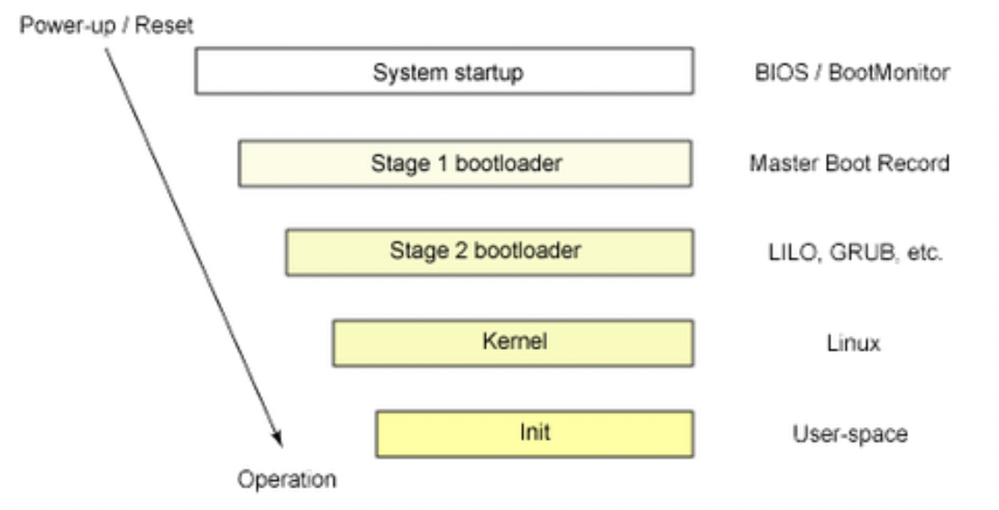
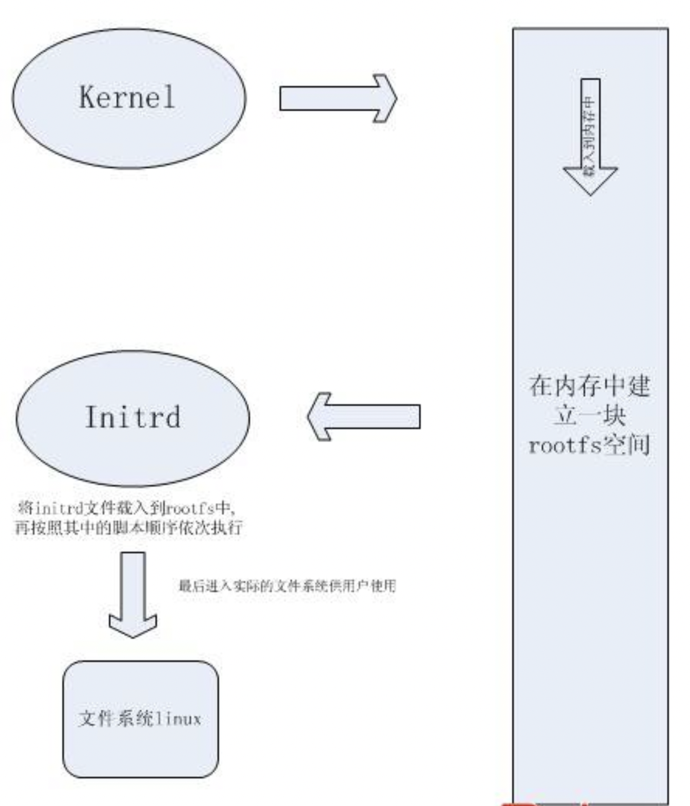

# 操作系统启动流程

计算机启动的基本过程包括4个阶段：按下电源 → BIOS自检 → 系统引导 → 启动内核

## 一、按下电源

按下电源，其实更科学的称呼是上电。上电后CPU的RESET引脚会由特殊的硬件电路产生一个逻辑值，这就是CPU的复位，此时CPU唤醒了，CPU从某个地址（如0FFFF FFF0，这个地址位于系统BIOS内）开始执行一条跳转指令，跳到系统BIOS中真正的启动代码处

## 二、BIOS自检

BIOS程序的主要作用是硬件自检（简称BIOS自检），然后将控制权转交给下一阶段的启动程序。

1. 系统BIOS的启动代码首先要做的事情就是进行POST（Power-On Self Test，加电后自检），POST的任务是检测系统中一些关键设备是否存在和能否正常工作，例如内存和显卡等设备
2. 接下来系统BIOS将查找显卡和其他设备的BIOS程序，并调用这些BIOS内部的初始化代码来初始化相关的设备
3. 接着系统BIOS会检测CPU、RAM和一些标准硬件设备和即插即用设备
4. 更新ESCD（扩展系统配置数据，是系统BIOS用来与操作系统交换硬件配置信息的一种手段）
5. 根据用户指定的“启动顺序”从软盘、硬盘或光驱启动

## 三、系统引导

BIOS代码运行结束，要将引导程序代码载入内存运行。PC上的引导代码（BootLoader程序）分为两部分，第一个部分位于`主引导记录（Master Boot Record，MBR）`上，这部分先启动，作用是引导位于某一个分区上的第二部分引导程序，如NTKLDR、 BOOTMGR、GRUB等。

### **第一部分：**

BIOS按照“启动顺序”，把控制权交给排在第一位的存储设备。这时，计算机读取该设备的第一个扇区，也就是读取最前面的512字节（主引导记录，MBR）。`MBR`的作用就是告诉计算机到硬盘的哪个位置找操作系统，由3个部分组成：

1. 第1~446字节：调用操作系统的的机器码（第一部分引导代码）
2. 第447~510字节：分区表 (Partition Table)
3. 第511、512字节：主引导记录签名 (0x55, 0xAA)，表明这个设备可以被启动，否则将控制权转交给“启动顺序”中的下一个设备

考虑到每个分区可以装不同的操作系统，因此MBR必须知道将控制权交给哪个区。分区表的长度
只有64个字节，里面又分为4项，每项16字节，所以硬盘最多只能分4个一级分区，又叫`“主分区”`。

### **第二部分：**

计算机将控制权交给硬盘的某个分区分成2种情况：

1. 要引导的操作系统位于激活的主分区里。4个主分区里面只有一个是激活的，计算机会读取激活分区的第一个扇区，这个分区叫做`“卷引导记录”（Volume Boot Record, VBR）`。VBR的主要作用就是告诉计算机操作系统在这个分区里的位置。随后，计算机就会加载操作系统了。
2. 要引导的操作系统位于逻辑分区里。随着硬盘越来越大，4个分区已经不够了，需要更多的分区，因此规定有且只有一个分区可以被定义成`“扩展分区"（Extended Partition）`。所谓“扩展分区〞，就是指这个区里面又分为好多区。这种分区里面又有分区就叫做`“逻辑分区”（Logical Partition）`，扩展分区包含一个或多个逻辑分区。
如果要启动`扩展分区（逻辑分区）`上的操作系统，计算机读取`MBR`前面446字节的机器码后，不再把控制权交给某一个分区，而是运行事先安排好的“启动管理器”程序（比如GRUB），这意味着第二部分引导代码启动了。它提示用户选择哪一个操作系统。Linux环境中，目前最流行的管理器是GRUB。

### **Stage 1.5**

BootLoader 第二部分（stage 2）就是在操作系统内核运行之前运行的一段小程序。通过这段小程序，我们可以初始化硬件设备、建立内存空间的映射图，从而将系统的软硬件环境带到一个合适的状态，以便为最终调用操作系统内核做好一切准备，并且加载内核。

通常把第一部分（stage1）和第二部分（stage2）的 BootLoader 合称为 Linux Loader（LILO）或是 x86 PC 环境下的 GRand Unified Bootloader（GRUB）。 GRUB相对于LILO的最大的好处是它能够读懂各种 linux 的文件系统。

实际上，GRUB把前面说的两个 stage 的 BootLoader 扩展到三个阶段，也就是在 stage1 之后，加入了 stage1.5，来完成对文件系统的认知。比如 reiserfs_stage1_5（从一个 Reiser文件系统）或者e2fs_stage1_5（从ext2或者ext3文件系统）加载。当这个stage1 BootLoader 加载运行之后，stage 2  BootLoader 才加载。

在 GRUB 中，通过文件`/boot/grub/grub.conf`来显示一个菜单或是输入命令。GRUB 是在grub.conf 的支配下运行的 ，一旦grub从它的命令行或者配置文件中，接到开始操作系统的正确指令，它就寻找必要的引导文件，然后把机器的控制权移交给操作系统。

## 四、启动内核

可以总结一下 linux 的启动流程：`系统预处理程序 → GRUB → kernel → initrd → system module`



GRUB 可以在多个操作系统共存时选择引导哪个系统。它可以载入操作系统的内核和初始化操作系统（如Linux, FreeBSD），或者把引导权交给操作系统（如Windows 98）来完成引导。用户选择后，就可以直接启动所选的操作系统了。系统引导也就结束了，下面也就到了操作系统内核登场。

阶段 kernal 由 GRUB 协助载入linux kernel，此时并没有任何目录产生。阶段 initrd 由GRUB协助一并载入 initrd 文件，让 kernel 支持更多的硬件，并产生根目录。

vmliux 是在启动过程中很重要的一个文件，这个文件实际上就是系统所使用的 kernel，若这个文件误删或者文件名字有误，GRUB就不能找到 kernel 进行启动。它的主要作用是：进程管理、内存管理、文件管理、驱动管理、网络管理。

**linux 环境的建立过程：**

1. 开机程序启动操作系统，kernel在加载之后（也就是当用户在开机画面选择某系统选项按【enter】之后），kernel 会自行在内存区建立一块叫做 rootfs 的区域供自己使用，里面的功能都是kernel本身所提供的。这期间根目录并没有产生。
2. 产生根目录的主要过程是：kernel 加载完之后，将 initrd.img 文件载入到 rootfs 中，再按照其中脚本文件依次执行，进一步挂载各种各样的模块。其中最重要的就是根文件系统驱动模块，有了它才能挂载根文件系统，这样在模块加载期间，根目录就产生了。
3. 最后进入实际的文件系统供用户使用。
4. 完成这一连串的动作之后，根目录就被 initrd 产生完毕，接着就是等待根目录下`/sbin/init`执行文件启动，由`init`文件将其下负责的软件或者服务依序执行，就可以将整个 Linux 所需的环境建立完成。



# 关键组成部分

## 一、rootfs 根文件系统

根文件系统是内核启动时所挂载（mount）的第一个文件系统，内核代码映像文件保存在根文件系统中，而系统引导启动程序会在根文件系统挂载之后，从中把一些基本的初始化脚本和服务等加载到内存中去运行。

根文件系统 rootfs 包含系统启动时所必须的目录和关键性的文件，以及使其他文件系统得以挂载（mount）所必要的文件。例如：

- init进程的应用程序必须运行在根文件系统上；
- 根文件系统提供了根目录“/”；
- linux挂载分区时所依赖的信息存放于根文件系统`/etc/fstab`这个文件中；
- shell命令程序必须运行在根文件系统上，譬如ls、cd等命令；

rootfs 是基于内存的文件系统，所有操作都在内存中完成；也没有实际的存储设备，所以不需要设备驱动程序的参与。基于以上原因，linux 在启动阶段使用 rootfs 文件系统，当磁盘驱动程序和磁盘文件系统成功加载后，linux 系统会将系统根目录从 rootfs 切换到磁盘文件系统。

正常来说，根文件系统至少包括以下目录：

- `/etc/`：存储重要的配置文件。
- `/bin/`：存储常用且开机时必须用到的执行文件。
- `/sbin/`：存储着开机过程中所需的系统执行文件。
- `/lib/`：存储`/bin/`及`/sbin/`的执行文件所需的链接库，以及 Linux 的内核模块。
- `/dev/`：存储设备文件。

## 二、initrd文件

GRUB 将 kernel 加载到内存并执行，kernel 在运行的后期会读取并执行`initrd`文件中的`init`脚本文件并按照其中命令逐行执行。

### **initrd 文件的功能**

1、提供开机必需的但`kernel`文件（即`vmlinuz`）没有提供的驱动模块（modules）

2、负责加载硬盘上的根文件系统并执行其中的`/sbin/init`程序进而将开机过程持续下去

### **initrd 是什么**

`initrd（initial ram disk）`是由 bootloader 初始化的内存盘，用一部分内存模拟成磁盘，让操作系统访问。initrd 会在内存虚拟一个文件系统，然后可以根据不同的硬件加载不同的驱动，而不需要重新编译整个内核。在编译内核时使用`make menuconfig`，对某些外驱动可以选择以模块编译，还是<*>直接编译到内核里面。

在 linux 启动之前，bootloader  会将它（通常是 initrd.img-xxx...xxx 文件）加载到内存中。内核启动的时候会将这个文件解开，并作为根文件系统使用，而启动阶段的驱动模块（如 jbd）放在这些文件系统上。内核是无法读取文件系统的，只能通过 initrd 启动的虚拟文件系统来装载这些模块。

既然内核此时不能读取文件系统，那内核的文件是怎么装入内存中的呢？答案很简单，Grub 是 file-system sensitive 的，能够识别常见的文件系统。

### **设计 initrd 的目的**

设计`initrd`的主要目的是让系统的启动分为两个阶段：首先，带有最少但是必要的驱动（这些驱动是在配置内核时选择嵌入方式）的内核启动。然后，其它需要的模块将从`initrd`中根据实际需要加载。这样就可以不必将所有的驱动都编译进内核，而根据实际情况有选择地加载。

### **initrd 的具体形式**

目前有两种形式：`cpio-initrd`和`image-initrd`。

```
cpio-initrd 的处理流程(内核空间->用户空间):
1．bootloader 把内核以及 initrd 文件加载到内存的特定位置。
2．内核判断 initrd 的文件格式，如果是 cpio 格式。
3．将 initrd 的内容释放到 rootfs 中。
4．执行 initrd 中的 /init 文件，执行到这，内核的工作全部结束，完全交给 /init 文件处理。
```

image-initrd 的制作相对麻烦，处理流程相对复杂（内核空间→用户空间→内核空间），主要是2.4及以前的kernel使用。

### **init 脚本文件**

以 linux2.6 的源码为例来分析init文件：

```bash
[ -d /dev ] || mkdir -m 0755 /dev
[ -d /root ] || mkdir -m 0700 /root   #这是硬盘上的根分区预先挂载到的目录
[ -d /sys ] || mkdir /sys
[ -d /proc ] || mkdir /proc
[ -d /tmp ] || mkdir /tmp
mkdir -p /var/lock
mount -t sysfs -o nodev,noexec,nosuid none /sys   #udev会参考的vfs，udev会根据其中的信息加载modules和创建设备文件
mount -t proc -o nodev,noexec,nosuid none /proc 
```

首先init文件建立相关目录和挂载点，并将 kernel 运行过程中产生的信息挂载到`/sys`和`/proc`目录下。`/sys`目录是 udev（管理设备事件的linux子系统）会参考的 vfs，udev 会根据其中的信息加载 modules 和创建设备文件，当不使用 udev 机制时`/sys`目录可以不建立。`/proc`目录和相应的proc文件系统必须建立和挂载，因为脚本会参考其中的`/proc/cmdline`文件获得 kernel 命令行上的参数。

```bash
......
if ! mount -t devtmpfs -o mode=0755 none /dev; then  # then的代码一般不会执行
    mount -t tmpfs -o mode=0755 none /dev
    mknod -m 0600 /dev/console c 5 1
    mknod /dev/null c 1 3
fi
......
```

这 一部分在 `/dev` 目录下建立 devtmpfs 文件系统，devtmpfs 是一个虚拟的文件系统，被挂载后会自动在`/dev`目录生成很多常见的设备节点文件， 当挂载 devtmpfs 失败时会手动建立`/dev/console`和`/dev/null`设备节点文件。

总而言之，init 脚本主要完成了：

- 首先建立一些必要的文件夹作为程序工作的时候需要的目录或者必要的挂载点，以及必需的设备节点。
- 然后，根据提供的参数建立适当的设备节点并加载适当的内核模块，启动适当的进程（udev）帮助完成这一步骤。当没有使用 udev 机制时应在`/conf/modules`中指明要加载的驱动，同时要自行建好相关的设备节点。
- 最后，在做完了这些乱七八糟的为挂载根目录及运行 init 进程作准备的事情之后，调用 run-init 来运行`/sbin/init`从而启动我们的系统。

Ubuntu 为了兼容各种不同的硬件配置将 init 脚本写的非常繁琐，在实际应用中可以根据自己主机的情况定制该文件。

# ISO 镜像中的各组成部分

Linux 的光盘安装使用的一般是 ISOLINUX 引导程序，系统启动时就自动加载ISOLINUX引导程序了。ISOLINUX 是  SYSLINUX 项目的一系列引导程序中的一个，简单的说就是类似 GRUB 的一个东西，就是启动然后引导内核。ISOLINUX 区别于 GRUB、LILO 等的地方，就是它可以认出 ISO 9660 文件系统，所以可以读出cd上的内核 kernel 镜像和 initrd 镜像，然后引导。

ISOLINUX 启动后，默认会去读出 cd 光盘根目录的 `/isolinux/isolinux.cfg` 文件，isolinux.cfg 类似grub的menu.lst，指定的内核镜像位置等。

ISO 光盘结构：

- `/isolinux` 目录存放光盘启动时的安装界面信息
- `/images` 目录包括了必要的启动映像文件，最重要的是引导第二阶段安装需要用到的镜像文件install.img（rhel 5中是stage2.img），anaconda 程序就在这个镜像文件中。
- ……

通过 iso 文件安装 linux 的流程为：

1. BIOS加电自检
2. 运行 isolinux 目录下面的 isolinux.bin 文件，这个 isolinux.bin 文件根据 isolinux.cfg 文件的选项来加载内核 vmlinuz 和 initrd.img 文件，initrd.img 文件会在内存中生成一个虚拟的linux操作系统，为安装过程提供一个安装环境。
3. initrd.img 文件中的 /sbin/loader 文件会探测安装介质，如果探测到是 cd 安装，就会运行 images 目录中的 install.img（安装过程需要的所有镜像）镜像文件，这个文件中最重要的就是anaconda程序。

文件调用顺序为：`isolinux/vmlinuz → isolinux/initrd.img → sbin/init → /sbin/loader → imagaes/install.img → /usr/bin/anaconda`

在编译内核时，使用`make menuconfig`来定制内核，对某些外驱动可以选择以模块编译，还是<*>直接编译到内核里面。通过`make`编译内核和模块，生成内核模块和 vmlinuz ，initrd.img，Symtem.map 文件。通过`make modules_install`安装内核和模块，复制模块文件到 /lib/modules目录下、复制config，vmlinuz，initrd.img，Symtem.map文件到 /boot 目录、更新grub

系统启动加载启动映像，在内存中建立了linux系统环境后，解析安装程序映像文件，将安装程序载入内存，执行主执行程序 `anaconda`，该程序是具体安装程序的一个入口，负责启动具体的安装过程，完成linux系统的安装。 Anaconda安装程序支持两种安装方式：交互式安装和非交互式安装。

- 交互式安装：就是安装过程中提示用户设置一些网络、和分区设置。
- 非交互式安装：通过kickstart配置文件实现自动化安装。
